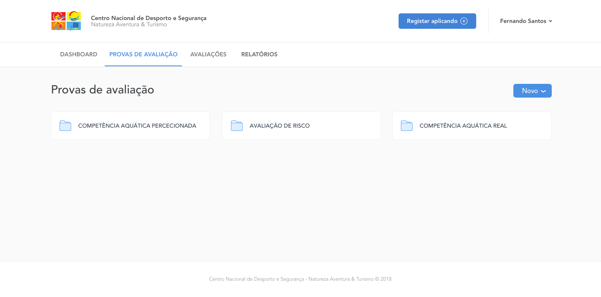
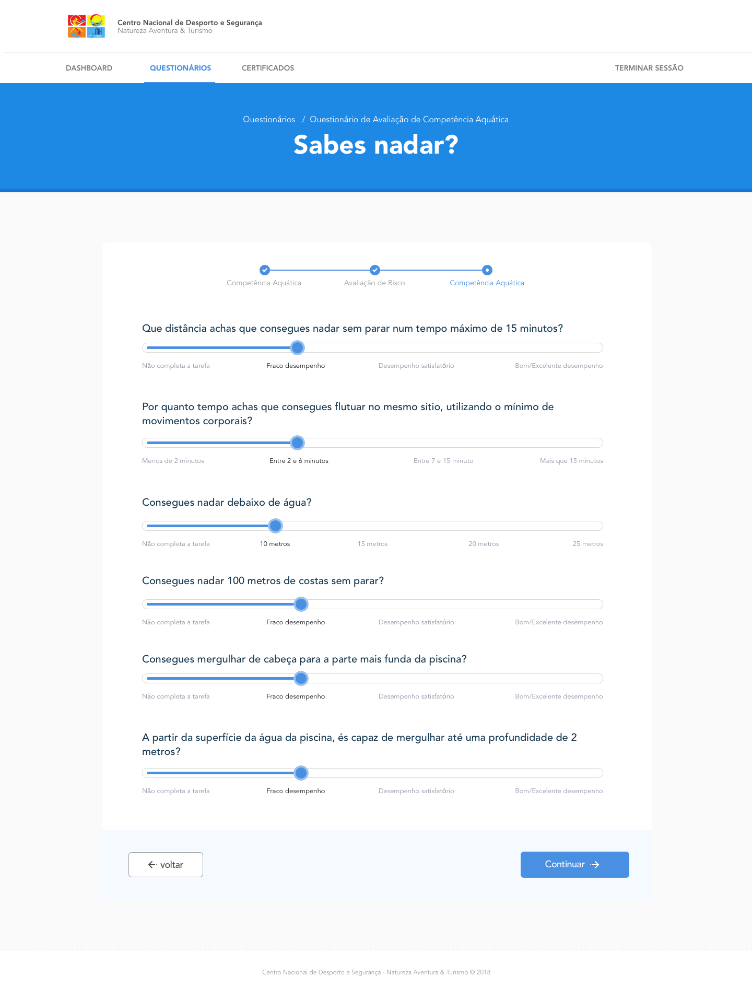

# Projeto FHM - Centro Nacional de Desporto e Segurança - Natureza Aventura & Turismo

# Avaliador

Quando um **avaliador** já se encontra registado na plataforma, é necessário iniciar sessão na plataforma para aceder aos conteúdos e ações disponíveis.

Após a sessão ter sido iniciada com sucesso, o **avaliador** terá acesso aos seguintes pontos:

- navegação dentro da plataforma de acordo com as permissões atribuídas;
- *dashboard* com estatísticas relacionadas com as provas de **avaliação**/**aplicando**;
- ação de registo de novo **aplicado** sempre disponível no cabeçalho da plataforma;
- menu relativo ao utilizador;

No menu "Provas de avaliação" o **avaliador** tem disponível as provas de avaliação:

- O click na prova irá listar os **aplicandos** para avaliação;
- O botão "novo" serve para uma nova avaliação rápida, onde será escolhida a avaliação de acordo com as provas disponíveis:
    - Competência aquática percepcionada;
    - Avaliação de risco;
    - Competência aquática real;

Após seleção de uma prova de avaliação, são listados os vários **aplicandos** inseridos pelo **avaliador** disponíveis para avaliação. 

Para avaliar um aplicando, caso este ainda não o tenha sido na prova referida, basta carregar no botão "Começar avaliação".

Quando uma avaliação é concluída, esta fica fica inserida no estado de **pendente**, que está inserido nos seguintes estados da avaliação:

- `Incompleto` (a prova foi iniciada, mas por algum motivo não chegou ao fim);
- `Pendente` (a prova foi concluída, mas não submetida / apta para revisão);
- `Submetida` (a prova foi submetida para avaliação automática do *score* do avaliando);

A partir do menu de navegação é possível consultar a área de relatórios gerados aos **aplicandos** após as avaliações terem sido concluídas com sucesso:

Na parte superior do cabeçalho, o botão "Registar aplicado" permite adicionar o registo de um novo **aplicando** na plataforma, onde é necessário o preenchimento obrigatório dos seguintes campos:

- `Nome` | `Data de nascimento` | `Número de contribuinte` (não identificado no protótipo);

# Aplicando

Após a conclusão do registo de um aplicado por parte do **avaliador**, este recebe um email de apresentação, com um link para a plataforma, onde são representados os seguintes cenários:

**O aplicando forneceu um email:**

- o acesso é feito a partir do email do **aplicando**;
- é gerada uma *password* automaticamente para acesso temporário descrita no email (esta pode e deve ser alterada posteriormente pelo aplicando):

**O aplicando apenas forneceu os dados obrigatórios:**

- é possível o aplicando aceder à área privada da plataforma através do **nif;**
- os dados requeridos são inseridos posteriormente ao inicio de sessão na plataforma;
- após a inserção de um **email**, é enviado um email de apresentação/confirmação para validação da conta;

Após a inserção e/ou atualização dos dados por parte do **aplicado**, são disponibilizadas as seguintes operações:

- Atalho para preenchimento de um questionário*;
- Consulta de relatórios adjacentes às avaliações feitas;
- Obter/consultar um certificado da avaliação;

*está descrito "formulário" no protótipo ao invés de questionário

- Caso o **aplicando** não tenha concluído o preenchimento de um questionário, será apresentada respectiva informação na *menu* de questionários;

    

O **aplicando** pode responder a um questionário, onde este é dividido por vários temas/áreas:

Dados sócio-geo-demográficos (caso ainda não preenchidos)

- competência aquática percecionada;
- avaliação de risco;
- competência aquática real;

Após conclusão dos questionários requeridos, e submetida a avaliação do **aplicado** por parte de um **avaliador**, estará disponível um relatório com os resultados referentes à avaliação:

Alguma informações poderão estar induzidas em erro.

Todos os ecrâs do protótipo são *drafts* conceptuais, pelo que estão sujeitos a futuras alterações.

## Os layouts poderão ser consultados com mais detalhe descompactando o arquivo "**FHM_MS_31112018.zip"** ou o respectivo ficheiro em formato .pdf.